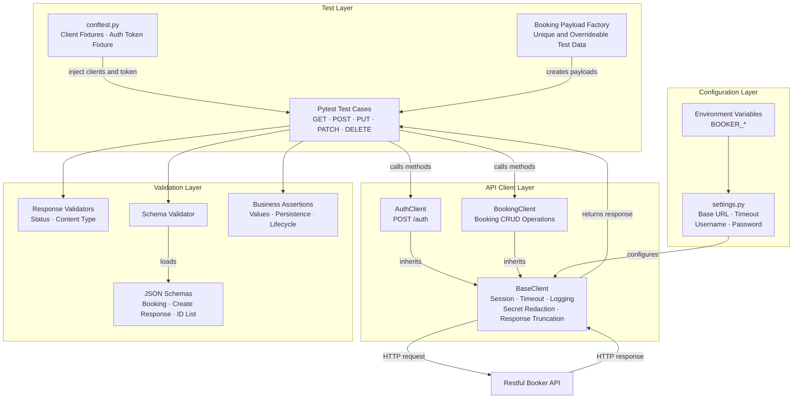

# Framework Architecture

## Component Diagram



## Request Flow

```text
Fixture → Test → Domain Client → BaseClient → Restful Booker API
                                             ↓
Test ← Response ← Safe Logging and Redaction ← Response
  ↓
Status Validation + Schema Validation + Business Validation
```

1. Pytest fixtures create reusable client objects and an authentication token.
2. A payload factory produces unique, overrideable booking data.
3. The test calls an operation on `AuthClient` or `BookingClient`.
4. The domain client delegates HTTP behavior to `BaseClient`.
5. `BaseClient` applies the base URL and timeout, reuses a session, and logs the
   request and response.
6. Passwords, tokens, and cookies are redacted, while large bodies are
   truncated before logging.
7. The response returns to the test for generic, structural, and business
   validation.

## Layer Responsibilities

| Layer | Responsibility |
| --- | --- |
| Tests | Describe scenarios and verify business behavior. |
| Fixtures | Inject clients and create shared authentication state. |
| Factories | Produce independent and customizable test data. |
| Domain clients | Represent authentication and booking API operations. |
| Base client | Centralize HTTP sessions, configuration, timeouts, and safe logging. |
| Response validators | Check generic properties such as status and content type. |
| Schema validator | Verify the structural contract of JSON responses. |
| Settings | Read environment-specific values without changing test code. |

## Validation Strategy

The framework deliberately separates three kinds of validation:

- **Generic validation:** checks status codes and response content types.
- **Schema validation:** checks required fields, data types, and nested JSON
  structure.
- **Business validation:** checks returned values, persistence, filtering, and
  resource lifecycle behavior.

Schema validation does not replace business assertions. A response can have the
correct structure while containing incorrect values.

## Interview Explanation

> The tests contain the scenario and business assertions. Pytest fixtures inject
> reusable clients and authentication. Payload factories generate independent
> test data. Domain clients describe API operations, while a shared base client
> handles HTTP sessions, environment configuration, timeouts, logging, and
> secret redaction. Responses are checked through reusable validators, JSON
> schemas, and test-specific business assertions.
